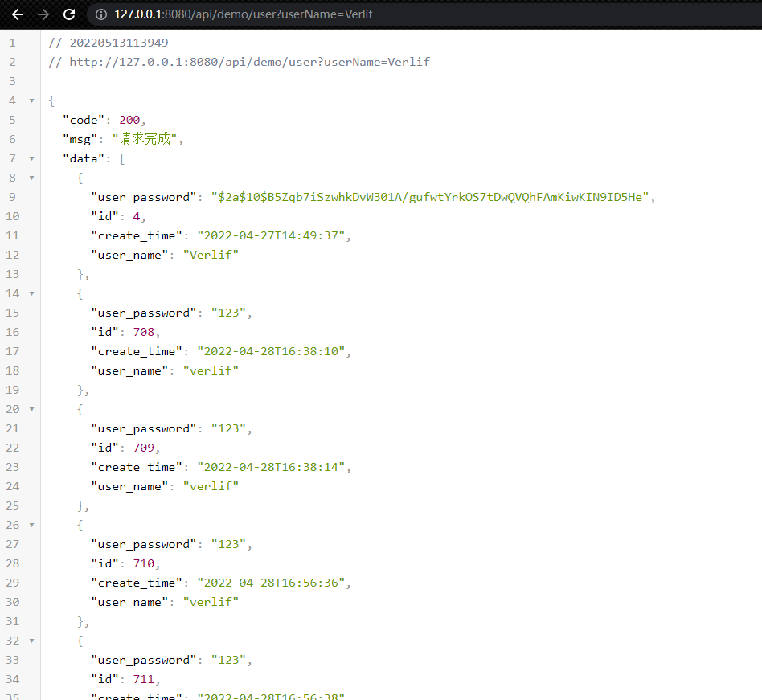
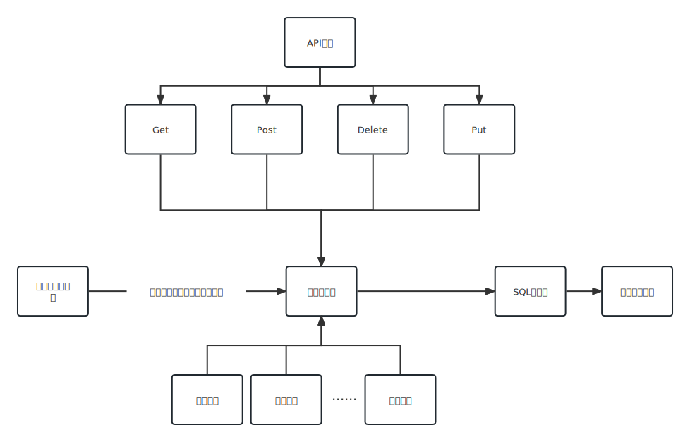

# Just Data

一个非常易用的后端接口生成服务，基于`SQL语句`与其中的`变量参数`动态生成后端接口。

## 特点

- __简单__。只需要会写`SQL`就可以使用。
- __可用__。提供了以下常用的功能：
  - __登录接口__。由使用者定义。
  - __接口权限__。对所有的内置接口与自定义接口进行鉴权处理，与登录接口绑定。
  - __文件接口__。文件上传、下载、查询等基础功能，并支持用户文件分区。
  - __通项接口管理__。通项接口信息查询、在线重载更新等。
  - __数据加密__。提供了`RSA`方式的数据加密方式，内置了公钥获取接口。
- __易用__。通过`xml`的方式添加数据库信息与接口信息，20行信息即可开启一个可访问的接口（[XML配置模板](template/template.xml)）。`SQL语句`支持动态方法，例如`if`、`trim`、`foreach`等。
- __多数据库__。不仅支持多种数据库，也支持同时连接访问多个不同的数据库。
- __配置丰富__。基于`Spring Boot`的`application.yml`配置，加入了`just-data`的单独配置。

## 使用场景

- __替代CRUD的后端开发__。对于基础的后端开发模式可以直接替换，减少开发时间与成本。
- __快速demo开发__。没有特殊的数据处理需求的demo，可以直接用于前端的对接。
- __数据展示__。对于只做数据库数据展示的服务，就只需要关注前端页面即可。
- __轻型项目开发__。适合一些例如毕业设计、作品展示等的项目发开。

## 使用

本服务使用的是`jar`文件方式，也就是说可以通过最基础`Java`命令启动。

```shell
java -jar just-data.jar
```

首先我们需要自己数据库的`jdbc`驱动包，请自行搜索并下载，格式是`jar`。随后编辑`application.yml`配置文件，例如我们使用的是`MySQL`数据库：

```yaml
just-data:
  # 需要加载的数据库驱动列表
  drivers:
      # 驱动名
    - driverName: com.mysql.cj.jdbc.Driver
      # 驱动文件地址
      driverFile: drivers\mysql-connector-java-8.0.27.jar
```

不知道数据库的驱动名的话可以对照 [数据库驱动名对照表](驱动名列表.md) ，没有使用的数据库的话请自行搜索确定。

随后我们创建以下的数据库信息与操作项（可参考 [配置模板](template/template.xml) ）：

```xml
<?xml version="1.0" encoding="UTF-8" ?>
<info>
    <dbs>
        <db>
            <label>demo</label>
            <url>jdbc:mysql://127.0.0.1:3306/demo?useSSL=false&amp;useUnicode=true&amp;serverTimezone=Hongkong&amp;characterEncoding=utf8&amp;allowPublicKeyRetrieval=true</url>
            <username>root</username>
            <password>password</password>
            <driver>com.mysql.cj.jdbc.Driver</driver>
        </db>
    </dbs>
    <items label="demo">
        <item name="获取其他用户信息">
            <api>user</api>
            <method>GET</method>
            <permission>admin</permission>
            <sql>SELECT * FROM t_user WHERE user_name = #{userName}</sql>
        </item>
    </items>
</info>
```

最后启动项目，本地访问 `http://127.0.0.1:8080/api/demo/user?userId=11` 即可得到以下信息：



*当然，这个前提是数据库可以 __连接__ （端口号、用户名、密码都输入正确）且`SQL语句`可以 __正常__ （没有语句错误）执行，然后是有`user_name`为`Verlif`的用户。*

## 架构图



## 其他说明

- [博客系统创建举例](一般流程说明.md)
- [Api日志配置](Api日志.md)
- [内置接口文档](内置接口文档.md)
- [操作项SQL格式规范](操作项SQL格式规范.md)
- [文件系统配置](文件操作.md)
- [登录与权限配置](登录与权限.md)
- [项目结构](项目结构.md)
- [数据库与驱动名列表](驱动名列表.md)